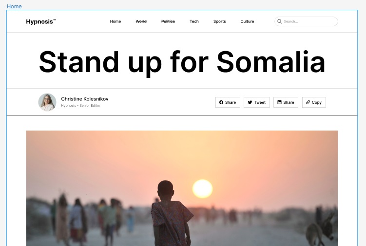
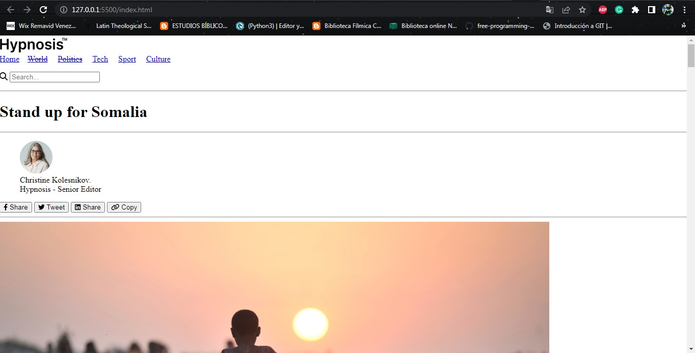
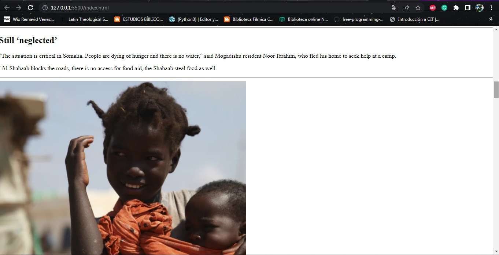
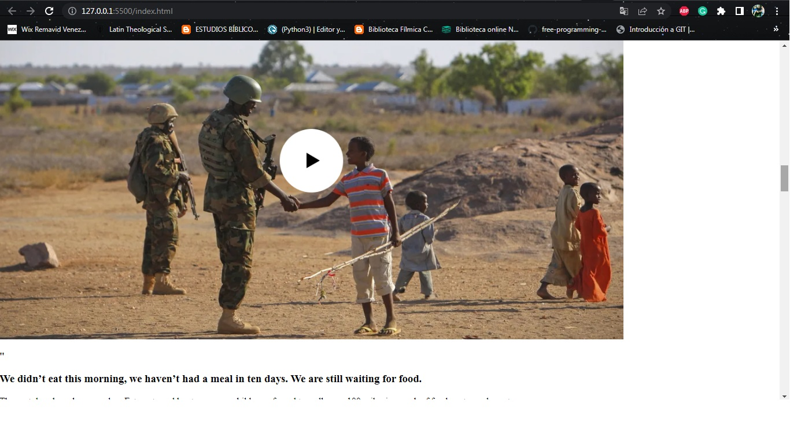
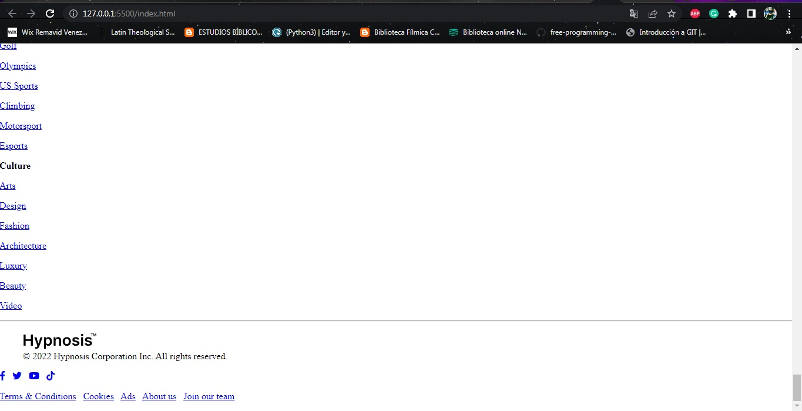

# HYPNOSIS

> Set up the project, the goal here is to master the tools and best practices about Linter and Gitflow and make the HTML schema of the following Figma design: [Hypnosis](https://www.figma.com/file/Ff1dN18GQSNumaa3Iz3BM1/Hypnosis---Neobrutalism-Magazine-Template-(Community)?node-id=49%3A15&t=eJPvslzLnvi5LgPR-0)

Original Design

Header Schema (HTML)

## Built With

- HTML

## Getting Started

### Prerequisites
- GIT 

### Setup
- Clone this [Repository](https://github.com/danyhoshi/hypnosis-project) in order to get a copy of this project
- From develop branch, open the index.html file with your browser.

## Authors

👤 **Author1**

- GitHub: [@danyhoshi](https://github.com/danyhoshi)
- LinkedIn: [@LinkedIn](https://www.linkedin.com/in/daniela-gonz%C3%A1lez-ba16a556/)
- Twitter: [@dany_hoshi](https://twitter.com/Dany_hoshi)

## 🤝 Contributing

Contributions, issues, and feature requests are welcome!

Feel free to check the [issues page](../../issues/).

## Show your support

Give a ⭐️ if you like this project!

## Acknowledgments

- Our Studying group!
- Figma Designer [Hendrid](hendridg@gmail.com)

## 📝 License

This project is [MIT](./MIT.md) licensed.
